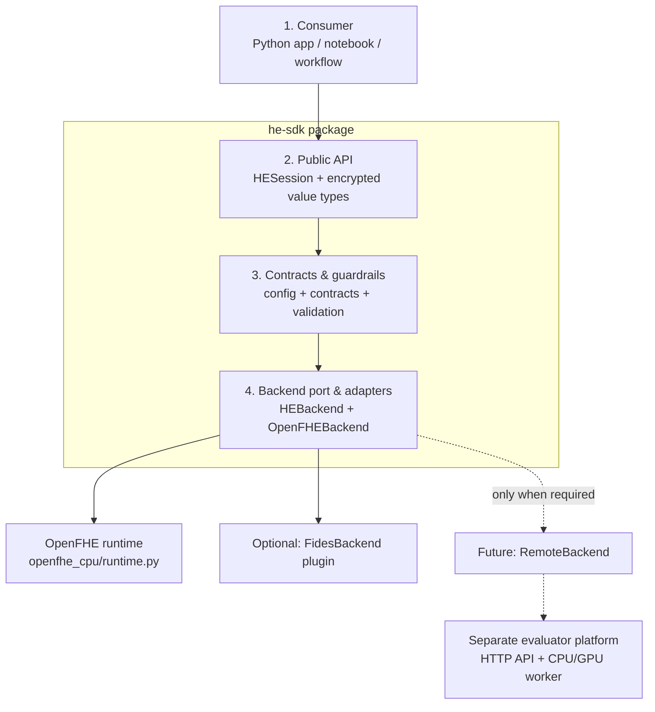
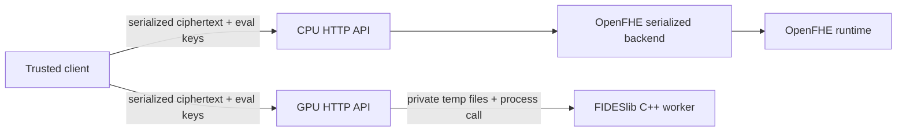

# Kiến trúc HE SDK: hiện trạng và ranh giới mục tiêu

## Quyết định kiến trúc

Ở phiên bản hiện tại, SDK nên được mô tả bằng **4 tầng nhỏ**. Hệ thống remote,
job controller, scheduler và object storage không phải là tầng nội bộ của SDK;
đó là một platform riêng chỉ nên xây khi có nhu cầu vận hành thực tế.



`RemoteBackend` trong hình là roadmap, chưa phải capability hiện tại.

## Các tầng thực sự đang có

| Tầng | Code hiện có | Trạng thái và trách nhiệm thật |
|---|---|---|
| 1. Consumer | `examples/sdk/local_openfhe.py`, application code của người dùng | Chuẩn bị plaintext, gọi SDK và giải mã trong trust boundary của client. Notebook, Data Studio hay workflow engine là integration của consumer, không phải code SDK. |
| 2. Public SDK API | `HESession`, `EncryptedVector`, `EncryptedScalar` | Đã có local API cho `encrypt`, `decrypt`, `add`, `subtract`, `multiply`, `square`, `sum`, `mean`, `variance`, cùng `save`, `load`, `open_workspace` cho filesystem handoff. Raw OpenFHE object được giữ trong opaque handle. Chưa có `compare` và chưa có lựa chọn remote. |
| 3. Contracts & guardrails | `CKKSConfig`; `OperationContract` và `CapabilitySet` trong `he_sdk/contracts.py`; `CiphertextMetadata`; validation trong `HESession` | Đã kiểm tra input range/shape, session, context fingerprint, key bundle, backend, scheme, serialization version và depth budget. Đây là vài dataclass nhỏ, chưa phải execution planner hay compatibility service độc lập. |
| 4. Backend port & adapter | `HEBackend` cùng factory trong `he_sdk/backends/base.py`; `OpenFHEBackend`, `openfhe_cpu/runtime.py`, optional `he-sdk-fides` plugin | `HESession` dispatch trực tiếp tới backend được chọn. OpenFHE local đã ổn định; FIDES native plugin source đã implement nhưng chỉ được support sau T4 build/equivalence gate. HEIR adapter không tồn tại. Không auto-route CPU/GPU và không fallback âm thầm. |

Một số tên hiện nghe mạnh hơn implementation thực tế:

- `CapabilitySet` là declaration tĩnh của từng backend, chưa phải capability
  registry có discovery;
- `compatibility/he-sdk-v1.toml` là manifest được pin và review trong Git,
  chưa phải runtime compatibility validator;
- `level` và `scale_bits` trong metadata hiện là SDK bookkeeping theo contract,
  chưa được đọc ngược từ native ciphertext để kiểm chứng;
- `checksum` được tạo cho public material/ciphertext trong workspace v1; local
  OpenFHE adapter hỗ trợ serialization nhưng chưa có database/object-store
  adapter;
- `OperationContract` mô tả operation, còn dispatch vẫn là lời gọi trực tiếp từ
  `HESession` tới backend; không có function graph hay execution planner.

## Những thành phần đang tồn tại nhưng không thuộc SDK local

Repository có một evaluator service đồng bộ:



Đây chưa phải `Remote Execution Control Plane`:

- request được xử lý đồng bộ, không có `RemoteExecutorClient` trong SDK;
- không có job resource, job controller, queue, scheduler hay state store;
- không có object storage; GPU adapter chỉ dùng temporary directory trong một
  request;
- worker không gọi `HESession`/SDK execution core. CPU path tái sử dụng
  `openfhe_cpu/runtime.py`; GPU path gọi native FIDESlib worker;
- production evaluator contract không nhận secret key. Encrypt/decrypt thuộc
  trusted client hoặc local `HESession`.

Vì vậy không nên gọi HTTP API và worker hiện có là tầng 5–6 của SDK. Chúng là
một deployment path song song, có thể trở thành remote backend sau này.

## Điều chỉnh mô hình 6 tầng đề xuất

| Thành phần trong mô hình cũ | Quyết định |
|---|---|
| Client / Developer Plane | Giữ, nhưng gọi đơn giản là **Consumer**. SDK không chịu trách nhiệm cho Notebook/Data Studio/workflow runtime. |
| SDK Public Contract | Giữ. Chỉ công bố các hàm đã chạy và test; bỏ `compare()` khỏi v1. |
| SDK Execution Core | Thu nhỏ thành **Contracts & guardrails**. Giữ validation, operation contract và capability declaration; chưa tách planner, registry hay chunk manager thành subsystem. |
| Backend Adapter Layer | Giữ. OpenFHE local là core backend. FIDES là optional native plugin có acceptance gate riêng; HEIR vẫn là roadmap. |
| Remote Execution Control Plane | Đưa ra ngoài SDK và chưa xây. Nếu cần remote trước, bắt đầu bằng một `RemoteBackend` đồng bộ gọi API hiện có. |
| Worker & Artifact Plane | Đưa vào evaluator platform, không phải package SDK. Chỉ thêm object storage/job manifest khi payload, timeout hoặc retry thực sự đòi hỏi. |

## Contract v0.4 nên công bố

- Local Python SDK, CKKS, một profile `ckks-balanced-v1`.
- Core backend supported: OpenFHE local. FIDES nằm trong package/plugin và
  release lifecycle riêng.
- Operations: add, subtract, multiply, square, sum, mean và population variance.
- Một ciphertext chứa tối đa `batch_size`; reduction hiện chỉ nhận một
  ciphertext. Chưa có automatic chunking.
- Một active OpenFHE session trên mỗi process do binding dùng process-global
  evaluation-key state.
- Có filesystem workspace versioned/checksummed cho public material và
  ciphertext; compute-only session không có secret key và không decrypt được.
- Không `compare`, bootstrap, automatic CPU/GPU selection, remote execution,
  async job, database hay object-store adapter.
- Secret key chỉ nằm trong local session/trusted client; evaluator không nhận
  secret key.

Đặc biệt, `compare()` không nên xuất hiện như một hàm thông thường của CKKS v1.
So sánh trên approximate ciphertext cần một polynomial/sign approximation,
range contract và depth/error budget riêng; một số thiết kế còn cần bootstrap.

## Khi nào mới thêm remote/job layers

### Bước tiếp theo tối thiểu nếu cần remote

Thêm `RemoteBackend` sau `HEBackend` và giữ nguyên public `HESession` contract:

```text
HESession -> RemoteBackend -> synchronous evaluator API -> compatible worker
```

Acceptance criteria tối thiểu:

1. artifact metadata và serialization contract có version;
2. SDK kiểm tra capabilities của endpoint trước khi gửi;
3. decrypted-equivalence test giữa local OpenFHE và remote CPU;
4. timeout rõ ràng và retry có request-id/idempotency contract;
5. không gửi secret key.

### Chỉ thêm job platform khi có ít nhất một nhu cầu đã đo được

- request thường xuyên vượt HTTP timeout;
- cần queue/fair scheduling cho nhiều user hoặc GPU khan hiếm;
- payload quá lớn để truyền trực tiếp;
- cần resume, cancellation, audit hoặc retention policy;
- cần retry bền vững qua worker/node failure.

Lúc đó mới tách `Job API -> controller/queue -> worker -> object store/state
store`. Không cần đưa các thành phần này vào wheel `he-sdk`; SDK chỉ cần một
remote client/backend.

## Quy tắc phát triển

Một feature mới đi theo đường ngắn nhất:

```text
operation contract
  -> HESession validation/public method
  -> supported backend implementation
  -> correctness and compatibility tests
  -> package release
```

Không tạo một service, image hoặc planner riêng cho từng HE function. Chỉ tách
component khi đã có ít nhất hai implementation hoặc một operational boundary
rõ ràng cần độc lập deploy/scale/fail.
