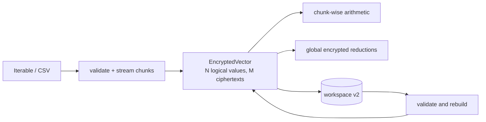

# SDK ciphertext chunking development contract

This document describes the isolated `0.5.0.dev0` feature branch. Stable SDK
`0.4.0` and workspace v1 remain unchanged on `main`.

The complete Mermaid source is in `he-sdk-chunking.mmd`.



## Public usage

Existing code remains valid and automatically chunks above 8,192 values:

```python
encrypted = session.encrypt(values)
result = session.mean(encrypted)
```

Memory-bounded iterable and CSV paths are explicit:

```python
encrypted = session.encrypt_iter(value_generator())
encrypted_csv = session.encrypt_csv(
    "payments.csv",
    column="amount",
    alignment_id="sha256-of-ordered-record-ids",
)
```

`chunk_size` defaults to the CKKS profile batch size (`8192`). It may be set
smaller for tests but never larger than the profile limit.

## Developer invariants

- `EncryptedVector` is one logical vector; native backend objects remain inside
  private `CiphertextChunk` instances.
- Chunk indices and offsets are contiguous and only the final chunk may be
  partial.
- Every chunk in a vector uses the same level and scale.
- Binary operations require equal logical length, chunk layout, per-chunk valid
  counts, packing layout and `alignment_id`.
- `alignment_id` is an owner assertion. For strong alignment it must be derived
  from stable ordered record identifiers before encryption.
- Reductions never decrypt partial values. Sum combines encrypted partial sums;
  mean and population variance scale encrypted global moments using encrypted
  public constants.
- Bootstrapping is not supported. Existing depth-budget rejection remains.

The main comments explaining these rules are in `he_sdk/ciphertext.py`,
`he_sdk/session.py`, and `he_sdk/artifacts.py`.

## Persistence

New workspaces use `he-sdk-workspace-v2`:

```text
workspace/
├── manifest.json
├── material/
└── ciphertexts/
    ├── input.part-000000.bin
    ├── input.part-000001.bin
    └── input.part-000002.bin
```

The v2 loader checks each checksum and reconstructs the vector only if chunk
indices, offsets, counts, level and scale are coherent. It can read stable v1
workspaces. It can also write a single ciphertext back to a v1 workspace while
omitting v2-only metadata; it refuses to place a multi-chunk value into v1.

## PostgreSQL boundary

Migration `002_ciphertext_chunks.sql` adds `artifact_sets` and
`ciphertext_chunks`. The schema supports transactionally storing a logical
value as ordered ciphertext rows. The Python SDK PostgreSQL repository is not
implemented in this branch yet; `HESession.save/load` continue to use a
filesystem/PVC workspace and do not pretend that a database connection exists.

## Remaining runtime gates

- Run native OpenFHE integration for 20,000 values in GitLab or the Linux
  notebook image.
- Run FIDES multi-chunk acceptance on the T4 server.
- Measure ciphertext size, runtime and noise/error for each reduction.
- Implement a storage adapter before making PostgreSQL a public SDK path.
