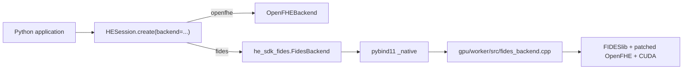

# FIDES backend trong package SDK

`he_looming_sdk==0.6.1` cung cấp một lệnh cài cho cả hai backend:

```sh
python3 -m pip install he_looming_sdk==0.6.1
```

Pip tự cài ba distribution sau; người dùng không cần cài từng package:

```text
he_looming_sdk==0.6.1
openfhe==1.5.1.0.24.4
he-sdk-fides==0.3.1
```

`he-sdk-fides` là native wheel Python 3.12/Linux x86_64. Wheel chứa Python
adapter và extension C++ liên kết FIDESlib, patched OpenFHE và CUDA runtime cần
thiết. NVIDIA driver và GPU phù hợp vẫn do môi trường chạy cung cấp.

## Luồng code



Hai package native được cài chung nhưng được import lazy. Một Python process
chỉ được chọn một backend vì stock OpenFHE và patched OpenFHE không an toàn khi
được load cùng process. Muốn đổi backend, chạy process Python mới:

```sh
HE_SDK_BACKEND=openfhe python3 examples/sdk/full_session_showcase.py
HE_SDK_BACKEND=fides python3 examples/sdk/full_session_showcase.py
```

SDK không tự fallback GPU sang CPU.

## Build và publish

`build-fides-sdk-wheel` dùng CUDA builder, build native extension rồi chạy
`auditwheel repair` để tạo wheel `manylinux_2_39_x86_64`. GitLab runner chỉ
kiểm tra compile/package; kiểm tra runtime vẫn chạy trên T4.

Release FIDES phải có trên PyPI trước core vì core phụ thuộc chính xác vào
`he-sdk-fides==0.3.1`.

Tạo GitLab variable bảo vệ sau trước lần publish đầu tiên:

```text
FIDES_PYPI_API_TOKEN = token PyPI có quyền tạo/publish project he-sdk-fides
```

Sau khi pipeline `main` thành công, publish theo thứ tự:

```sh
git fetch origin main
git tag -a fides-v0.3.1 origin/main -m "Publish he-sdk-fides 0.3.1"
git push origin fides-v0.3.1
```

Chờ cả `publish-fides-sdk-gitlab` và `publish-fides-sdk-pypi` thành công rồi
mới tạo tag core `v0.6.1`; xem `he-sdk-pypi.md`.

## Giới hạn hiện tại

- Python 3.12, Linux x86_64, glibc 2.39 hoặc mới hơn;
- CUDA build target `75-real` cho NVIDIA T4;
- không tự cài NVIDIA driver;
- không load CPU OpenFHE và GPU FIDES native backend trong cùng process;
- GPU runtime acceptance vẫn phải chạy trên GPU server.
