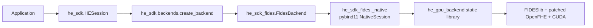

# FIDES GPU SDK plugin

`he-sdk-fides` is the optional Linux/CUDA plugin that implements the same
`HESession` contract as the core OpenFHE backend:

```python
from he_sdk import HESession

with HESession.create(backend="fides") as he:
    encrypted = he.encrypt([1.0, 2.0, 3.0, 4.0])
    result = he.variance(encrypted)
    print(he.decrypt(result))
```

The public source is implemented, but it remains experimental until the native
tag pipeline compiles it and the T4 runner passes all seven decrypted-result
equivalence checks.

## Code path



`he-gpu-worker`, `he-gpu-demo`, and the Python extension all link the same
`he_gpu_backend` target. The operation implementations remain in
`gpu/worker/src/fides_backend.cpp`.

The local plugin is a trusted process: its native session owns context, public
and secret keys, encryption and decryption. This differs from the existing
secretless HTTP evaluator, which never receives a secret key.

## Packages and compatibility boundary

Keep these packages separate:

```text
he-sdk==0.3.1          lightweight backend-neutral core
he-sdk-fides==0.1.0    Linux/Python/CUDA native plugin
```

Do not install the stock `openfhe` Python wheel in the FIDES environment. The
plugin is compiled with FIDESlib's matching patched OpenFHE, CUDA 12.9.1 and
the configured `FIDESLIB_ARCH` (`75-real` for the T4).

The generated native wheel is platform- and Python-ABI-specific. Build it with
the same Python minor version used on the target server; the current CI builder
uses Ubuntu 24.04/Python 3.12.

## CI build and acceptance

The pipeline has four relevant jobs:

1. `build-sdk-wheel` builds the core wheel.
2. `build-fides-sdk-wheel` builds the native plugin in the CUDA Docker builder.
3. `test-fides-sdk-native` runs on a GitLab runner tagged `gpu` and executes all
   seven operations on the GPU.
4. `publish-fides-sdk-gitlab` uploads the plugin only after the GPU test stage
   passes.

The GPU job compares decrypted results from isolated OpenFHE and FIDES smoke
jobs. It never loads stock OpenFHE and patched OpenFHE into one process.

For a build-only artifact on `main`, manually start `build-fides-sdk-wheel`.
The wheel is also stored under `/opt/he-sdk-fides-wheel` in the GPU image.

To release version `0.1.0`, first configure an NVIDIA-enabled GitLab runner
with the tag `gpu`. Publish `he-sdk==0.3.1` first because it is the plugin's
exact core dependency, then push:

```sh
git tag -a fides-v0.1.0 -m "Publish he-sdk-fides 0.1.0"
git push origin fides-v0.1.0
```

If there is no online runner tagged `gpu`, the release pipeline intentionally
waits instead of publishing an untested native wheel.

## Install on the GPU server

Prepare the read-only GitLab deploy token as described in
`he-sdk-gitlab-registry.md`. Install both private packages without the OpenFHE
extra:

```sh
SDK_INDEX="https://gitlab.com/api/v4/projects/nhatcao99uetwork%2Fk3s-demo-app/packages/pypi/simple"

python3 -m venv .venv
. .venv/bin/activate
python -m pip install --upgrade pip
python -m pip install --no-deps --index-url "$SDK_INDEX" he-sdk==0.3.1
python -m pip install --no-deps --index-url "$SDK_INDEX" he-sdk-fides==0.1.0
```

The commands assume the deploy-token credentials are stored in `~/.netrc`.
Run the complete contract:

```sh
HE_SDK_BACKEND=fides python -m he_sdk.smoke
```

`examples/sdk/local_fides.py` can also be run from a repository checkout; the
example directory is not installed by the core wheel.

Expected smoke output contains:

```text
SDK_SMOKE_RESULT={"backend":"fides",...,"status":"PASS"}
```

## Deliberate non-goals

- no automatic CPU/GPU selection;
- no silent CPU fallback;
- no remote client, scheduler or job controller;
- no mixing of ciphertexts from different sessions;
- no bootstrap, comparison or automatic chunk manager;
- no claim of portability beyond the CI-tested Python/CUDA/Linux profile.
