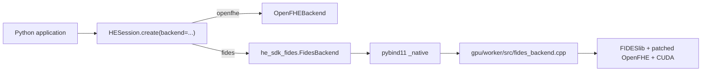

# FIDES backend trong package SDK

`he_looming_sdk==0.6.1` cung cấp extra GPU, nhưng native FIDES vẫn là một
distribution riêng do CI của project build:

```sh
python3 -m pip install "he_looming_sdk[gpu]==0.6.1"
```

Pip cài hai distribution sau trong GPU environment:

```text
he_looming_sdk==0.6.1
he-sdk-fides==0.3.2
```

`he-sdk-fides` là native wheel Python 3.12/Linux x86_64. Wheel chứa Python
adapter và extension C++ liên kết FIDESlib, patched OpenFHE và CUDA runtime cần
thiết. NVIDIA driver và GPU phù hợp vẫn do môi trường chạy cung cấp.

## Luồng code



Không cài extra `cpu` trong GPU environment. Stock OpenFHE và patched OpenFHE
không an toàn khi được load cùng process. Dùng hai virtual environment riêng:

```sh
python3 -m pip install "he_looming_sdk[cpu]==0.6.1"
HE_SDK_BACKEND=openfhe python3 examples/sdk/full_session_showcase.py

python3 -m pip install "he_looming_sdk[gpu]==0.6.1"
HE_SDK_BACKEND=fides python3 examples/sdk/full_session_showcase.py
```

SDK không tự fallback GPU sang CPU.

## Build và publish

`build-fides-sdk-wheel` dùng CUDA builder, build native extension rồi chạy
`auditwheel repair` để tạo wheel `manylinux_2_39_x86_64`. GitLab runner chỉ
kiểm tra compile/package; kiểm tra runtime vẫn chạy trên T4.

Release FIDES phải có trên PyPI trước core nếu public `gpu` extra được cam kết
hoạt động. Extra chỉ yêu cầu pip tải plugin; nó không tự build hoặc publish
native wheel.

Tạo GitLab variable bảo vệ sau trước lần publish đầu tiên:

```text
FIDES_PYPI_API_TOKEN = token PyPI có quyền tạo/publish project he-sdk-fides
```

Sau khi pipeline `main` thành công, publish theo thứ tự:

```sh
git fetch origin main
git tag -a fides-v0.3.2 origin/main -m "Publish he-sdk-fides 0.3.2"
git push origin fides-v0.3.2
```

Chờ cả `publish-fides-sdk-gitlab` và `publish-fides-sdk-pypi` thành công rồi
mới tạo tag core `v0.6.1`; xem `he-sdk-pypi.md`.

## Giới hạn hiện tại

- Python 3.12, Linux x86_64, glibc 2.39 hoặc mới hơn;
- CUDA build target `75-real` cho NVIDIA T4;
- không tự cài NVIDIA driver;
- wheel FIDES vẫn phải do project build và publish riêng;
- không load CPU OpenFHE và GPU FIDES native backend trong cùng process;
- GPU runtime acceptance vẫn phải chạy trên GPU server.
