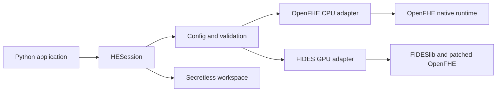

# Ghi chú nguồn cho tài liệu tích hợp HE SDK

Tài liệu này là nguồn nội dung ngắn gọn để viết tài liệu tích hợp
`he_looming_sdk`. Chỉ mô tả capability đã có trong code; các phần chưa phát
hành hoặc chưa kiểm thử trên GPU được ghi rõ trạng thái.

## 1. Mục tiêu và phạm vi

`he_looming_sdk` cung cấp Python API thống nhất để ứng dụng:

1. tạo CKKS context và key material;
2. mã hóa vector số thực tại trusted client;
3. tính toán trên ciphertext;
4. giải mã kết quả tại nơi giữ secret key;
5. lưu/load public material và ciphertext bằng workspace;
6. phát hành một số kết quả tổng hợp cho recipient bằng proxy re-encryption.

SDK local không tự gọi HTTP evaluator, không phải job scheduler và không tự
chuyển workload giữa CPU/GPU. HTTP evaluator trong repository là một deployment
path riêng.

## 2. Trạng thái phát hành

| Thành phần | Phiên bản | Nguồn | Trạng thái |
|---|---:|---|---|
| Core + CPU extra | `he_looming_sdk[cpu]==0.6.4` | Public PyPI | Đã publish |
| Core source hiện tại | `0.6.5` | Nhánh `main` | Development, chưa publish |
| GPU component đã phát hành | `he-sdk-fides==0.3.3` | GitLab Package Registry | Đã publish wheel `cp312-manylinux_2_39_x86_64` |
| GPU component source | `0.3.6` | Nhánh `main` | Development, chưa publish |
| GPU notebook image | `dockerboi99/he_k8s:notebook-gpu-latest` | Nhánh `gpu-notebook-image` | Chỉ khả dụng sau khi job image push tag thành công |

## 3. Kiến trúc tích hợp



Luồng gọi cơ bản:

```text
application
  -> HESession.create(device="cpu" | "gpu")
  -> encrypt(plaintext vector)
  -> HE operation(ciphertext)
  -> decrypt(result ciphertext)
  -> close()
```

CPU và GPU phải chạy trong environment/process riêng. Không load stock
OpenFHE và FIDESlib patched OpenFHE vào cùng một Python process.

## 4. Yêu cầu môi trường

### CPU

- Linux x86_64;
- Python 3.12;
- hiện ưu tiên Ubuntu 24.04;
- GNU OpenMP runtime `libgomp1`.

OpenFHE wheel hiện yêu cầu C++ runtime mới hơn Google Colab cung cấp, nên CPU
package không được xem là hỗ trợ Colab tại thời điểm này.

### GPU

- Linux x86_64 và Python 3.12;
- NVIDIA GPU, driver và CUDA runtime tương thích;
- target thử nghiệm hiện tại: NVIDIA T4, compute capability 7.5;
- FIDESlib phải dùng đúng patched OpenFHE đi kèm, không dùng stock OpenFHE.

## 5. Cài đặt

Hướng dẫn canonical: [`he-sdk-install.md`](he-sdk-install.md).

CPU đã phát hành:

```bash
sudo apt-get update
sudo apt-get install -y libgomp1 python3.12-venv

python3.12 -m venv .venv-he-cpu
source .venv-he-cpu/bin/activate
python -m pip install --upgrade pip
python -m pip install "he_looming_sdk[cpu]==0.6.4"
```

GPU đã phát hành, nhưng phải kiểm tra host trước:

```bash
uname -m
python3.12 --version
ldd --version | head -n 1
nvidia-smi --query-gpu=name,compute_cap,driver_version --format=csv,noheader
```

Wheel hiện tại yêu cầu Linux x86_64, CPython 3.12 và glibc từ 2.39. Native
target đã kiểm thử là NVIDIA T4, compute capability 7.5. Sau đó cài package:

```bash
python3.12 -m venv .venv-he-gpu
source .venv-he-gpu/bin/activate
python -m pip install --upgrade pip
python -m pip install \
  --extra-index-url "https://gitlab.com/api/v4/projects/84844502/packages/pypi/simple" \
  "he_looming_sdk[gpu]==0.6.4"

python -m pip show he_looming_sdk he-sdk-fides
python -m pip check
```

Core `0.6.4` pin GPU component `he-sdk-fides==0.3.3`. Không cài `[cpu]` và
`[gpu]` trong cùng environment; không dùng `--no-deps`; không cần `git clone`,
CMake hoặc build FIDESlib trên máy người dùng. Google Colab hosted hiện không
nằm trong platform support của wheel. Xem kiểm tra registry, import, smoke test
và troubleshooting đầy đủ tại [`he-sdk-install.md`](he-sdk-install.md).

## 6. Code tích hợp CPU tối thiểu

```python
from he_sdk import HESession

values_a = [1.0, 2.0, 3.0, 4.0]
values_b = [10.0, 20.0, 30.0, 40.0]

with HESession.create(device="cpu") as session:
    encrypted_a = session.encrypt(values_a)
    encrypted_b = session.encrypt(values_b)

    encrypted_add = session.add(encrypted_a, encrypted_b)
    encrypted_sum = session.sum(encrypted_a)

    print(session.decrypt(encrypted_add))  # approximately [11, 22, 33, 44]
    print(session.decrypt(encrypted_sum))  # approximately 10
```

CKKS là approximate HE; ứng dụng phải so sánh kết quả bằng tolerance thay vì
so sánh số thực tuyệt đối.

## 7. Public API hiện có

| Hàm | Input | Output | Yêu cầu chính |
|---|---|---|---|
| `HESession.create()` | `device="cpu"` hoặc `"gpu"`, optional config | `HESession` | Backend tương ứng đã cài |
| `encrypt()` | Sequence số thực | `EncryptedVector` | Session có public key |
| `decrypt()` | `EncryptedVector` hoặc `EncryptedScalar` | List hoặc scalar plaintext | Session có secret key |
| `add()` | Hai encrypted vector cùng shape | Encrypted vector | Cùng context/key bundle |
| `subtract()` | Hai encrypted vector cùng shape | Encrypted vector | Cùng context/key bundle |
| `multiply()` | Hai encrypted vector cùng shape | Encrypted vector | Multiplication key, depth 1 |
| `square()` | Một encrypted vector | Encrypted vector | Multiplication key, depth 1 |
| `sum()` | Một encrypted vector | Encrypted scalar | Rotation/EvalSum keys |
| `mean()` | Một encrypted vector | Encrypted scalar | Rotation keys, depth 1 |
| `variance()` | Một encrypted vector | Encrypted scalar | Mult + rotation keys, depth 2 |
| `save()` | Ciphertext, workspace, name | Artifact path | Backend hỗ trợ serialization |
| `load()` | Workspace và artifact name | Encrypted value | Context/workspace tương thích |
| `open_workspace()` | Workspace path | Compute-only session | Public/evaluation material hợp lệ |
| `create_result_recipient()` | Không | Recipient với key pair riêng | CPU OpenFHE PRE trial |
| `reencrypt_for_recipient()` | Aggregate result + recipient public key | `ReleasedResult` | Chỉ `sum`, `mean`, `variance` |
| `close()` | Session | Không | Giải phóng native context/key state |

Chưa hỗ trợ `compare`, `max`, bootstrap, automatic chunking, remote backend,
async job hoặc automatic CPU/GPU fallback trong SDK local.

## 8. Input, output và metadata

Profile duy nhất hiện tại: `ckks-balanced-v1`.

| Thuộc tính | Giá trị mặc định |
|---|---:|
| Scheme | CKKS |
| Security level | `HEStd_128_classic` |
| Multiplicative depth | 3 |
| Ring dimension | 16384 |
| Batch size | 8192 |
| First modulus size | 60 bits |
| Scaling modulus size | 50 bits |
| Scaling technique | `FLEXIBLEAUTO` |
| Input range | `[-40000, 40000]` |
| Bootstrap | Tắt |

Một `EncryptedVector` mang metadata để SDK kiểm tra tương thích:

- context ID và context fingerprint;
- key-bundle ID;
- backend, scheme và engine version;
- logical shape và valid element count;
- level, scale bits và serialization version;
- checksum khi ciphertext được lưu;
- operation provenance đối với reduction result.

SDK v1 chỉ xử lý tối đa một CKKS batch. Reduction chưa tự chia nhiều
ciphertext; ứng dụng phải chia chunk ở tầng ngoài nếu dữ liệu vượt 8192 phần tử.

## 9. Workspace compute-only

Workspace chứa:

```text
workspace/
├── manifest.json
├── material/
│   ├── context.bin
│   ├── public-key.bin
│   ├── multiplication-keys.bin
│   └── rotation-keys.bin
└── ciphertexts/
    └── <artifact-name>.bin
```

Workspace ghi checksum và khai báo rõ:

```text
contains_plaintext = false
contains_secret_key = false
```

Luồng handoff:

```python
# Trusted owner
owner = HESession.create(device="cpu")
encrypted = owner.encrypt([10.0, 20.0, 30.0])
owner.save(encrypted, "./workspace", name="input")
owner.close()

# Compute process mới, không có secret key
compute = HESession.open_workspace("./workspace")
loaded = compute.load("./workspace", name="input")
encrypted_sum = compute.sum(loaded)
compute.save(encrypted_sum, "./workspace", name="sum")
compute.close()
```

Compute-only session có thể load, tính và save ciphertext nhưng gọi `decrypt()`
sẽ nhận `SecretKeyUnavailableError`. Secret key không được khôi phục từ
workspace.

## 10. Phát hành kết quả cho recipient

Recipient có key pair khác owner. Chỉ public key của recipient đi vào release
authority; recipient secret key không được lưu trong workspace.

```text
owner result bundle
  -> proxy re-encryption bằng recipient public key
  -> released result mang recipient ID làm target key-bundle ID
  -> recipient dùng secret key riêng để decrypt
```

Code mẫu:

```python
recipient = owner.create_result_recipient()
recipient.save_public_key("./workspace/recipient")

public_key = owner.load_recipient_public_key("./workspace/recipient")
released_sum = owner.reencrypt_for_recipient(encrypted_sum, public_key)
owner.save(released_sum, "./workspace", name="released_sum")

recipient_result = recipient.load("./workspace", name="released_sum")
print(recipient.decrypt(recipient_result))
```

Release policy hiện chỉ chấp nhận aggregate scalar có provenance `sum`, `mean`
hoặc `variance`. Đây là policy guardrail của SDK; không nên mô tả nó như một
giới hạn toán học tuyệt đối của PRE.

## 11. GPU integration hiện tại

Native GPU implementation nằm trong:

```text
gpu/he_sdk_fides/                 Python package và pybind11 binding
gpu/worker/src/fides_backend.cpp  FIDES operations
gpu/Dockerfile                    FIDESlib + patched OpenFHE build
```

GPU wheel `0.3.3` đã có trong GitLab Package Registry. Một đường dùng thử khác,
không cài package trực tiếp lên host, là prebuilt Jupyter image được định nghĩa
trên nhánh `gpu-notebook-image`:

```text
docker.io/dockerboi99/he_k8s:notebook-gpu-latest
```

Image chứa sẵn CUDA userspace, FIDESlib, patched OpenFHE, native binding, core
SDK, JupyterLab và notebook. CI chỉ compile image; phép HE thật phải được chạy
trên NVIDIA GPU host. Chỉ dùng tag `notebook-gpu-latest` sau khi job
`build-he-notebook-gpu` thực sự chạy thành công và push image; pipeline kiểm tra
gần nhất chưa chạy job image này.

## 12. HTTP evaluator là integration khác

Repository còn có CPU/GPU HTTP services với các endpoint chính:

```text
GET  /healthz
GET  /readyz
GET  /v1/capabilities
POST /v1/evaluate
POST /v1/demo/evaluate
```

`/v1/evaluate` là ciphertext API và không nhận plaintext hoặc secret key.
`/v1/demo/evaluate` nhận plaintext để test nhanh và benchmark, không phải
production security boundary. `HESession` hiện không tự gọi các endpoint này.

Nếu tích hợp remote trong tương lai, hướng tối thiểu là:

```text
HESession -> RemoteBackend -> evaluator API -> CPU/GPU worker
```

Remote backend chưa tồn tại trong version hiện tại.

## 13. Ranh giới bảo mật

- Plaintext và secret key thuộc trusted client/owner.
- Evaluator và compute-only workspace không nhận secret key.
- Workspace không lưu plaintext hoặc secret key.
- Ciphertext từ context/key bundle khác nhau bị từ chối.
- Không commit token, private key hoặc generated workspace vào Git.
- Không load hai OpenFHE runtime không tương thích trong cùng process.
- Demo plaintext endpoint không được dùng để chứng minh confidentiality.

## 14. Các lỗi tích hợp thường gặp

| Lỗi | Nguyên nhân thường gặp | Hướng xử lý |
|---|---|---|
| `No module named openfhe` | CPU extra chưa được cài | Cài `he_looming_sdk[cpu]` |
| `GLIBCXX_3.4.32 not found` | OS/libstdc++ cũ hơn OpenFHE wheel | Dùng Ubuntu 24.04-compatible environment |
| `No matching distribution: he-sdk-fides` | Sai Python/platform/glibc hoặc registry không có version được pin | Dùng CPython 3.12, Linux x86_64, glibc từ 2.39 và kiểm tra GitLab package index |
| `libcuda.so.1: cannot open` | NVIDIA driver/device chưa được expose | Sửa driver hoặc NVIDIA Container Toolkit; cài lại pip không giải quyết lỗi này |
| `no kernel image is available` | GPU architecture không có trong wheel | Dùng T4/sm_75 hoặc phát hành wheel cho architecture mới |
| Incompatible ciphertext | Khác session/context/key bundle/shape | Dùng ciphertext sinh từ cùng session-compatible material |
| `SecretKeyUnavailableError` | Compute-only session cố decrypt | Chuyển result về owner hoặc release cho recipient |
| Depth exceeded | Chuỗi multiply/square/variance vượt profile | Thiết kế lại workload/profile; không tăng depth tùy tiện |

## 15. Acceptance checklist

### CPU package

- Cài bằng một lệnh pip trong Python 3.12/Linux.
- Import `he_sdk` và `openfhe` thành công.
- Encrypt/decrypt và bảy operation cho kết quả trong tolerance.
- Save/load giữ nguyên context và key-bundle metadata.
- Compute-only session không decrypt được.
- Recipient chỉ decrypt được result đã release cho recipient đó.

### GPU package/image

- Không build FIDESlib tại consumer runtime.
- Native component dùng patched OpenFHE, không stock OpenFHE.
- Container thấy NVIDIA device và tạo được `device="gpu"` session.
- Add, subtract, multiply, square, sum, mean và variance chạy trên T4.
- CPU/GPU correctness được so sánh bằng cùng input và tolerance CKKS.
- Pin đúng cặp core `0.6.4` và FIDES component `0.3.3`.
- Cài từ registry và chạy native smoke test thành công trước benchmark.

## 16. File nguồn để review

| Nội dung | File |
|---|---|
| Public session API | `he_sdk/session.py` |
| Config/profile | `he_sdk/config.py` |
| Operation contracts | `he_sdk/contracts.py` |
| Ciphertext metadata | `he_sdk/ciphertext.py` |
| Backend selection | `he_sdk/backends/base.py` |
| CPU adapter | `he_sdk/backends/openfhe.py` |
| CPU HE functions | `openfhe_cpu/runtime.py` |
| Workspace format | `he_sdk/artifacts.py` |
| Recipient/PRE types | `he_sdk/result_release.py` |
| Released artifacts | `he_sdk/release_artifacts.py` |
| GPU binding | `gpu/he_sdk_fides/` |
| GPU HE functions | `gpu/worker/src/fides_backend.cpp` |
| Compatibility manifest | `compatibility/he-sdk-v1.toml` |
| CPU full lifecycle example | `examples/notebooks/cpu_full_session_showcase.ipynb` |
| Install commands | `docs/he-sdk-install.md` |

## 17. Điểm cần nhắc khi viết tài liệu chính thức

HE parameters hiện là trial defaults, chưa phải profile tối ưu cho mọi
workload. Sau khi hoàn thành correctness và benchmark CPU/GPU cho toàn bộ
operation, cần đo và tinh chỉnh multiplicative depth, modulus sizes, scaling,
relinearization và rotation strategy theo workload. Không có một bộ tham số
tối ưu chung cho tất cả phép tính.
