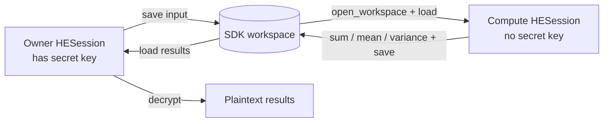

# SDK-only encrypted workspace

Workspace v2 adds transparent multi-ciphertext vectors to the existing
two-process HE workflow without adding an HTTP client to the SDK. The new
loader remains able to read stable version-0.4 workspace v1 artifacts.



## Public API

Owner process:

```python
from he_sdk import HESession

owner = HESession.create(backend="openfhe")
encrypted = owner.encrypt([10.0, 20.0, 30.0])
owner.save(encrypted, "./he-workspace", name="input")
```

Independent compute process:

```python
from he_sdk import HESession

with HESession.open_workspace("./he-workspace") as compute:
    encrypted = compute.load("./he-workspace", name="input")
    compute.save(compute.sum(encrypted), "./he-workspace", name="sum")
    compute.save(compute.mean(encrypted), "./he-workspace", name="mean")
    compute.save(
        compute.variance(encrypted),
        "./he-workspace",
        name="variance",
    )
```

Back in the still-running owner process:

```python
result = owner.decrypt(owner.load("./he-workspace", name="sum"))
```

## Workspace contract

The workspace contains:

```text
he-workspace/
├── manifest.json
├── material/
│   ├── context.bin
│   ├── public-key.bin
│   ├── multiplication-keys.bin
│   └── rotation-keys.bin
└── ciphertexts/
    ├── input.part-000000.bin
    ├── input.part-000001.bin
    ├── sum.bin
    ├── mean.bin
    └── variance.bin
```

`manifest.json` records the format version, complete CKKS configuration,
context/key identities, artifact kind, logical shape, chunk order/count,
per-chunk valid count, level, and SHA-256 for every binary file. Loading rejects
incompatible sessions, unsafe names, missing/reordered chunks, incomplete
logical counts, and checksum changes.

The workspace never contains plaintext or the secret key. It does reveal the
backend, scheme, configuration, operation artifact names, and logical input
length. Those fields are required to validate and evaluate the ciphertext and
must not be treated as hidden metadata.

## Current boundary

The owner session must remain alive until it decrypts results. This release
does not persist the secret key by design. Losing the owner process therefore
makes the stored ciphertext unrecoverable.

The path can be a normal directory today and a mounted PVC tomorrow. Database
storage, object storage, Docker, Kubernetes, and remote execution are outside
this SDK-only contract.

## Notebook test

Run the notebooks in order using two separate kernels:

1. `examples/notebooks/01_owner_encrypt.ipynb`
2. `examples/notebooks/02_compute_encrypted.ipynb`
3. return to notebook 01 for result decryption

The compute notebook imports only `he_sdk`; it does not import OpenFHE or call
an HTTP endpoint directly.
