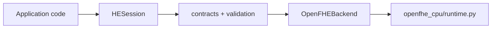

# Local HE SDK

The local SDK and the deployed evaluator reuse the same HE functions. They
have different wrappers, not different HE implementations.



The synchronous CPU/GPU HTTP evaluators are a separate deployment path, not
layers inside the current local SDK. See `he-sdk-architecture.md` for the
implemented layer inventory, deliberately reduced target architecture, and
the conditions for introducing a remote backend or asynchronous job platform.

## Current status

- `HESession`, `CKKSConfig`, `EncryptedVector`, and `EncryptedScalar` are
  implemented.
- The local OpenFHE backend calls `OpenFHECPU` in
  `openfhe_cpu/runtime.py`. The CPU HTTP evaluator calls the free functions in
  that same file.
- Add, subtract, multiply, square, sum, mean, and population variance are
  exposed by the local SDK.
- FIDES remains available through the existing GPU image/service. The optional
  local `he-sdk-fides` plugin source and pybind11 session are implemented. A
  release stays gated on native compilation and decrypted-equivalence tests on
  the T4 runner; without the installed plugin, selection remains an explicit
  `BackendUnavailableError`.

## Install and run

The pure package and contract tests do not install OpenFHE:

```sh
python3 -m unittest discover -s tests -v
python3 -m build --wheel
```

GitLab keeps the wheel as a `build-sdk-wheel` artifact for 30 days. On the
default branch, the CPU image build consumes that exact artifact and stores the
wheel, `SHA256SUMS`, and compatibility manifest under `/opt/he-sdk-wheel/`.
The immutable Docker Hub image therefore remains a durable carrier for both
the service runtime and its matching wheel.

A version tag also publishes the wheel to the project's private GitLab PyPI
registry for normal `pip` installation on another server. See
`he-sdk-gitlab-registry.md` for publishing, authentication, and a standalone
Python smoke test.

Run the native integration on supported Linux or in GitLab CI:

```sh
python3 -m pip install '.[openfhe]'
python3 examples/sdk/local_openfhe.py
python3 -m unittest tests.test_sdk_openfhe_integration -v
```

Do not install CUDA, FIDESlib, or patched OpenFHE on a low-powered development
laptop. Their native build and runtime checks belong in CI and on the T4
server.

On K3s, use the companion `k3s-demo-gitops/scripts/sdk/run-smoke.sh` helper.
It installs the embedded wheel into a temporary directory and runs
`python -m he_sdk.smoke`; it does not install anything on the node itself.

## Development rule

For a CPU operation, put the HE calculation in `openfhe_cpu/runtime.py`. The
local wrapper calls it through `he_sdk/backends/openfhe.py`; the serialized
service calls it through `backends/openfhe_python.py`.

For a GPU operation, put the HE calculation in
`gpu/worker/src/fides_backend.cpp`. The existing worker is the service wrapper.
The `gpu/he_sdk_fides/native/bindings.cpp` extension is the local SDK wrapper
over that same C++ class. See `he-sdk-fides.md` for its separate wheel, CI gate,
and GPU-server installation path.

An operation is complete only after its contract, local wrapper, service
wrapper, decrypted correctness test, immutable image build, and K3s smoke test
all pass for each advertised backend.
