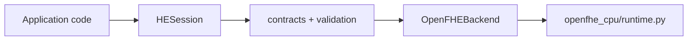

# Local HE SDK

The local SDK and the deployed evaluator reuse the same HE functions. They
have different wrappers, not different HE implementations.



The synchronous CPU/GPU HTTP evaluators are a separate deployment path, not
layers inside the current local SDK. See `he-sdk-architecture.md` for the
implemented layer inventory, deliberately reduced target architecture, and
the conditions for introducing a remote backend or asynchronous job platform.

## Current status

- `HESession`, `CKKSConfig`, `EncryptedVector`, and `EncryptedScalar` are
  implemented.
- The local OpenFHE backend calls `OpenFHECPU` in
  `openfhe_cpu/runtime.py`. The CPU HTTP evaluator calls the free functions in
  that same file.
- Add, subtract, multiply, square, sum, mean, and population variance are
  exposed by the local SDK.
- `HESession.save()`, `HESession.load()`, and
  `HESession.open_workspace()` provide a versioned, checksummed filesystem
  handoff. The compute-only session loads public/evaluation material and
  ciphertext but has no secret key, so the SDK rejects decryption there.
- FIDES remains available through the existing GPU image/service. The local
  `he-sdk-fides` native component and pybind11 session are implemented. The
  non-GPU CI runner compiles it, while runtime acceptance happens after
  deployment on the K3s T4 node.

## Install and run

The pure package and contract tests do not install OpenFHE:

```sh
python3 -m unittest discover -s tests -v
python3 -m build --wheel
```

GitLab keeps the wheel as a `build-sdk-wheel` artifact for 60 days. On the
default branch, the CPU image build consumes that exact artifact and stores the
wheel, `SHA256SUMS`, and compatibility manifest under `/opt/he-sdk-wheel/`.
The immutable Docker Hub image therefore remains a durable carrier for both
the service runtime and its matching wheel.

A version tag publishes the `he_looming_sdk` wheel to public PyPI and to the
project's private GitLab PyPI registry. See `he-sdk-pypi.md` for the public
release and `he-sdk-gitlab-registry.md` for the private fallback.

Install exactly one native backend in each supported Python 3.12/Linux
environment:

```sh
python3 -m pip install "he_looming_sdk[cpu]==0.6.4"
python3 examples/sdk/full_session_showcase.py

# Run in a separate virtual environment on a CUDA host:
python3 -m pip install \
  --extra-index-url "https://gitlab.com/api/v4/projects/84844502/packages/pypi/simple" \
  "he_looming_sdk[gpu]==0.6.4"
python3 examples/sdk/full_session_showcase.py
```

Application code normally calls `HESession.create()` without a backend name.
The SDK selects the only installed extra. For debugging, `device="cpu"` or
`device="gpu"` is available as an explicit override.

For the SDK-only two-kernel walkthrough, run
`examples/notebooks/01_owner_encrypt.ipynb` and then
`examples/notebooks/02_compute_encrypted.ipynb`. The artifact contract and
security boundary are documented in `he-sdk-workspace.md`.

The CPU extra installs the public OpenFHE binding. The GPU extra installs the
separately built `he-sdk-fides` wheel. Neither extra supplies an NVIDIA driver
or physical GPU; those remain environment prerequisites.

On K3s, use the companion `k3s-demo-gitops/scripts/sdk/run-smoke.sh` helper.
It installs the embedded wheel into a temporary directory and runs
`python -m he_sdk.smoke`; it does not install anything on the node itself.

## Development rule

For a CPU operation, put the HE calculation in `openfhe_cpu/runtime.py`. The
local wrapper calls it through `he_sdk/backends/openfhe.py`; the serialized
service calls it through `backends/openfhe_python.py`.

For a GPU operation, put the HE calculation in
`gpu/worker/src/fides_backend.cpp`. The existing worker is the service wrapper.
The `gpu/he_sdk_fides/native/bindings.cpp` extension is the local SDK wrapper
over that same C++ class. See `he-sdk-fides.md` for its native wheel and release
gate. It is installed transitively only when the `gpu` extra is requested.

An operation is complete only after its contract, local wrapper, service
wrapper, decrypted correctness test, immutable image build, and K3s smoke test
all pass for each advertised backend.
